<p align="center">
  
</p>

<p align="center">
  <b>🚀 Building • Learning • Exploring AI & Machine Learning</b>
</p>


<!-- ================= HERO ================= -->

<picture>
  <source media="(prefers-color-scheme: dark)" srcset="./dark.svg">
  <source media="(prefers-color-scheme: light)" srcset="./light.svg">
  
</picture>

<br>

# 👋 Hi, I'm Gaurav Giri

### AI / ML Enthusiast • Developer • Problem Solver

I'm a **2nd-year Information Technology student at MIT Academy of Engineering (MITAOE), Alandi, Pune**, passionate about **Artificial Intelligence, Machine Learning, Software Development, and Data Analytics**.

I enjoy learning by building practical projects, experimenting with technologies, and continuously improving my programming and problem-solving skills.

---

## 🚀 About Me

- 🎓 2nd Year Information Technology Student at **MITAOE**
- 🤖 Interested in **Artificial Intelligence & Machine Learning**
- 🐍 Currently working with **Python**
- 📊 Exploring **Data Analytics & Data Science**
- 💻 Interested in **Software & Web Development**
- 🧠 Improving **Data Structures & Algorithms**
- 💼 Completed a **Cisco Internship**
- 🔨 Learning by building practical projects
- 🌱 Always exploring new technologies

---

## 🧠 Skills & Technologies

### 💻 Programming & Development


>

## 📊 GitHub Statistics

<p align="center">
  
</p>

## 🔥 GitHub Streak

<p align="center">
  
</p>
## 💻 Top Languages

<p align="center">
  
</p>

---


## 🏆 GitHub Trophies

<p align="center">
  
</p>
```text
Python
HTML / CSS
JavaScript
SQL
Git & GitHub
```
---

## 👀 Profile Visitors

<p align="center">
  
</p>
---

## 🛠️ Tech Stack

<p align="center">
  
</p>

## 🐍 Contribution Snake

<p align="center">
  
</p>

---

---

## 🎮 Pac-Man Contribution Game

<p align="center">
  <picture>
    <source
      media="(prefers-color-scheme: dark)"
      srcset="https://raw.githubusercontent.com/gaurav24giri-design/gaurav24giri-design/pacman-output/pacman-contribution-graph-dark.svg">
    <source
      media="(prefers-color-scheme: light)"
      srcset="https://raw.githubusercontent.com/gaurav24giri-design/gaurav24giri-design/pacman-output/pacman-contribution-graph.svg">
    
  </picture>
</p>
---

## 🧱 Breakout Contribution Game

<p align="center">
  <picture>
    <source
      media="(prefers-color-scheme: dark)"
      srcset="https://raw.githubusercontent.com/gaurav24giri-design/gaurav24giri-design/arcade-output/breakout-contribution-graph-dark.svg">
    <source
      media="(prefers-color-scheme: light)"
      srcset="https://raw.githubusercontent.com/gaurav24giri-design/gaurav24giri-design/arcade-output/breakout-contribution-graph.svg">
    
  </picture>
</p>
---

## 🚀 Galaga Contribution Game

<p align="center">
  <picture>
    <source
      media="(prefers-color-scheme: dark)"
      srcset="https://raw.githubusercontent.com/gaurav24giri-design/gaurav24giri-design/arcade-output/galaga-contribution-graph-dark.svg">
    <source
      media="(prefers-color-scheme: light)"
      srcset="https://raw.githubusercontent.com/gaurav24giri-design/gaurav24giri-design/arcade-output/galaga-contribution-graph.svg">
    
  </picture>
</p>
---

## 🚀 Featured Projects

### 📘 Facebook Clone Website

A responsive Facebook-inspired website clone built to practice frontend web development and user interface design. This project recreates the look and structure of a social media platform with a clean and organized layout.

#### ✨ Features

- 📱 Responsive website layout
- 🏠 Facebook-style homepage interface
- 👤 User profile and navigation sections
- 🎨 Clean and modern UI
- 💻 Structured HTML and CSS
- 📂 Organized project structure

#### 🛠️ Technologies Used

`HTML` `CSS`

#### 🔗 Project

[](https://github.com/gaurav24giri-design/fb-clone-website)
---

## 🎓 Education

### 🏫 MIT Academy of Engineering (MITAOE)

**Bachelor of Technology (B.Tech) — Information Technology**

📍 Alandi, Pune, Maharashtra  
📚 2nd Year Undergraduate

---

## 💼 Internship Experience

### 🏢 Cisco Internship

**Intern — Cisco**

Gained practical exposure to a professional technology environment and strengthened my understanding of industry practices, technical problem-solving, and continuous learning.

---

## 📜 Certifications

- 🤖 **Machine Learning Fundamentals** — Infosys
- 🐍 **Machine Learning with Python** — Infosys


---

## 🧠 Currently Learning

- 🤖 Artificial Intelligence & Machine Learning
- 🐍 Advanced Python
- 📊 Data Science & Data Analysis
- 🧩 Data Structures & Algorithms
- 🌐 Software Development

- ---

## 🎯 2026 Goals

- 🚀 Build real-world AI/ML projects
- 📚 Strengthen Data Structures & Algorithms
- 💻 Improve Python and software development skills
- 🤝 Contribute to open-source projects
- 💼 Gain more industry experience through internships

- ---

## ⚡ Fun Fact

> 💡 I believe the best way to learn technology is by building something with it.

---

<p align="center">
  <b>✨ Thanks for visiting my GitHub profile! ✨</b>
</p>

## 🤝 Let's Connect

<p align="center">
  <a href="https://www.linkedin.com/in/gaurav-giri-725143434">
    
  </a>
  <a href="mailto:gaurav24giri@gmail.com">
    
  </a>
</p>

<p align="center">
  💡 Open to learning, collaboration, internships, and exciting technology opportunities.
</p>

<p align="center">
  ⭐ Thanks for visiting my GitHub profile!
</p>
